# 路由监视器 RouterMonitor
[[toc]]
## 前言
> 这个项目当前功能还比较简单，配置功能的完善比我预期的要麻烦，但是耐不住大家都很期待，因此就先开源再完善，有能力的小伙伴可以先玩起来，也欢迎贡献PR.

作者是一个对监测类软件情有独钟的人，比如windows上常用traffic monitor, mac就用腾讯的柠檬助手。 会把网速、cpu占用、温度等等信息挂在菜单栏，以此来作为一些程序是否正常运行的判断依据。

年初的时候意外接触到了ESP8266做的墨水屏日历，后来家里添置了软路由后，便鬼使神差的想着能不能做一个监视屏，然后就做了这个，起初的版本还没有图表，后来看到了Uinify路由器的小屏幕，便增加了图表的功能。

## 先上图
|RouterMonitor |  皮卡丘涂装   |
|----|  ----  |
| 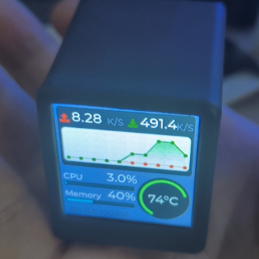 |   | 

- [RouterMonitor演示视频](https://www.bilibili.com/video/BV1km4y1L7YY/)
- [皮卡丘演示视频](https://www.bilibili.com/video/BV1BM4y1W78d/)

# 硬件资料

由于最初对这个功能的定位就是监视屏，也比较了市面上很多开源项目，出于成本考虑选择了SD2小电视的方案
https://oshwhub.com/Q21182889/esp-xiao-dian-shi

## 其他参考开源项目
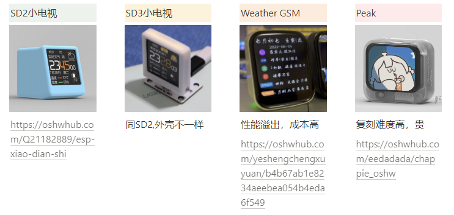
- **Weather GSM** https://oshwhub.com/yeshengchengxuyuan/b4b67ab1e8234aeebea054b4eda6f549
- **Peak** https://oshwhub.com/eedadada/chappie_oshw

# 软件
## 数据信息来源 NetData
https://www.netdata.cloud/ 
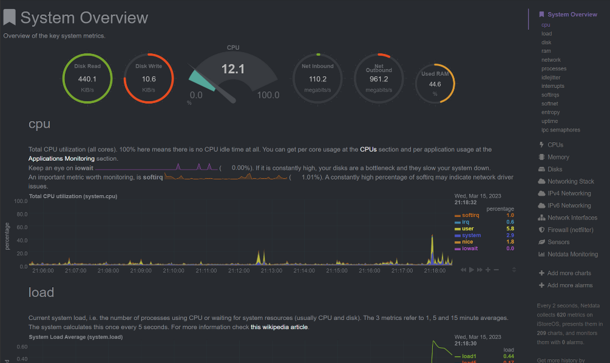

NetData 提供了Web API 用于获取数据信息 https://learn.netdata.cloud/docs/rest-api/api
| 数据信息 | 接口 |
|-- | --- |
|CPU数据| /api/v1/data?chart=system.cpu&after=-10&format=array&points=10 |
|内存占用| /api/v1/data?chart=mem.available&format=array&points=1&group=average |
|网速监控-下行| /api/v1/data?chart=net.eth0&format=array&after=-10&points=10&dimensions=received|
|网速监控-上行| /api/v1/data?chart=net.eth0&format=array&after=-10&points=10&dimensions=sent |
|温度信息|  /api/v1/data?chart=system.cpu&after=-10&format=array&points=10 |

## UI界面绘制 LVGL
参考官方文档  https://docs.lvgl.io/7.11/
由于ESP8266使用的 lvgl版本比较低，无法使用官方的UI制作工作[SquareLine Studio](https://squareline.io/)
所以只能看文档写好了。

# 环境配置
Windows和mac都可以配置，M1的也可以，这里只提供windows的环境配置教程

## 0. 硬件购买
提供了三种方案和成本供大家评估选择
-  **简单模式**：小电视硬件成品的话可以去淘宝咸鱼PDD搜SD2小电视，一般价格在50左右，听说有个店39元包邮
  > 选择购买成品的小伙伴请务必跟卖家确认小电视是不是带CH340芯片，支持自己烧录固件，因为这个芯片单价就2块钱，有些卖家会选去掉这个芯片节约成本  
-  **中等难度**：淘宝买个ESP8266的开发板，加一个 1.3寸的TFT屏幕,带数据线，大概30块钱，没有外壳
-  **困难等级**： 如果想自己练习焊接，可以去嘉立创打板，购买零件、3D外壳打印，一站式(成本也最高，算上焊接工具，成本得300左右)

## 1. CH340驱动安装
### 1.1 驱动下载安装
https://www.wch.cn/downloads/category/67.html?feature=USB%E8%BD%AC%E4%B8%B2%E5%8F%A3&product_name=CH340

根据自己的平台下载对应的版本然后安装。

### 1.2 检验安装是否成功
使用usb的数据线连接小电视或者开发板，如果 `资源管理器`面板可以看到新增了串口，说明安装成功
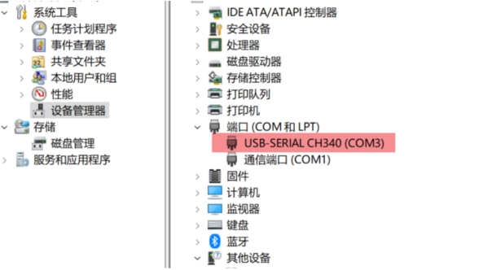

## 2. 开发环境搭建
1. 安装Visual Studio Code
2. 安装插件 PlatformIO
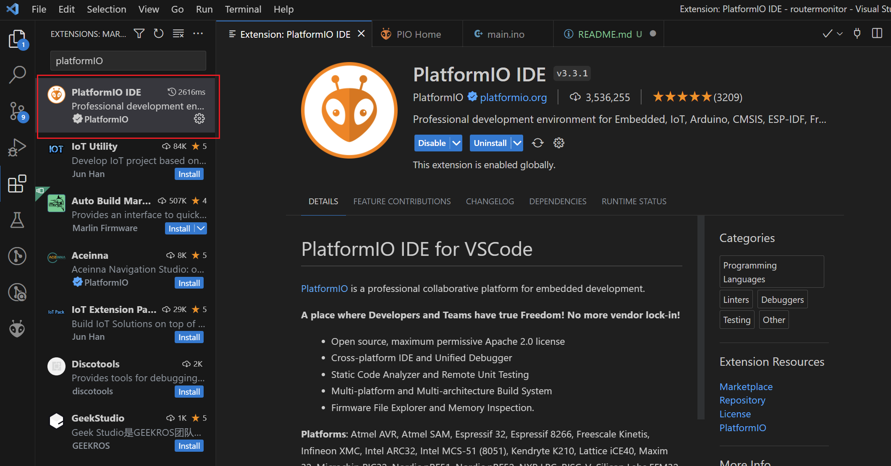
3. Clone 代码，然后打开即可

## 3. 修改代码配置
代码很简单，只有两个文件，应该很容易看得懂

- main.ino 主要逻辑
- NetData.h 基于封装的获取netdata的接口

> 扛不住大家的热情（嗯，不是因为我懒）配置功能还没有完善，我就决定先开源了，所以有能力的小伙伴可以先改代码定制自己的RouterMonitor

1. 修改默认的连接Wifi的账号和密码
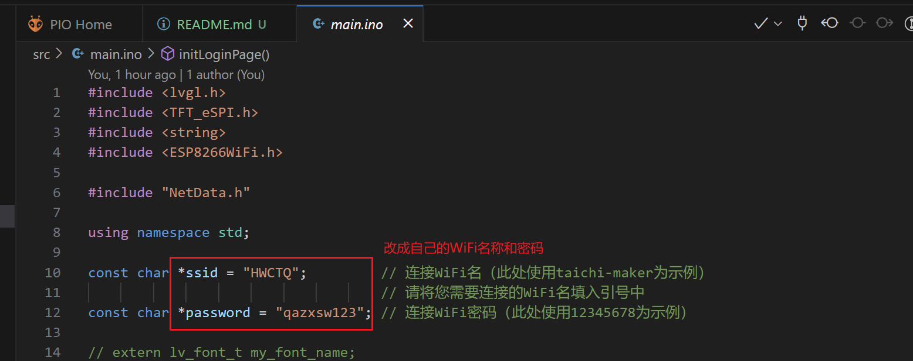

2. 修改软路由的地址
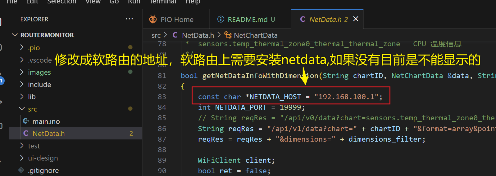

3. 修改内存大小
> 由于我r2s内存就是1G,图方便写了1024,大家根据实际情况修改，不然会出现内存显示错误,参见[Issue](https://gitee.com/dannylsl/routermonitor/issues/I7QX5V)
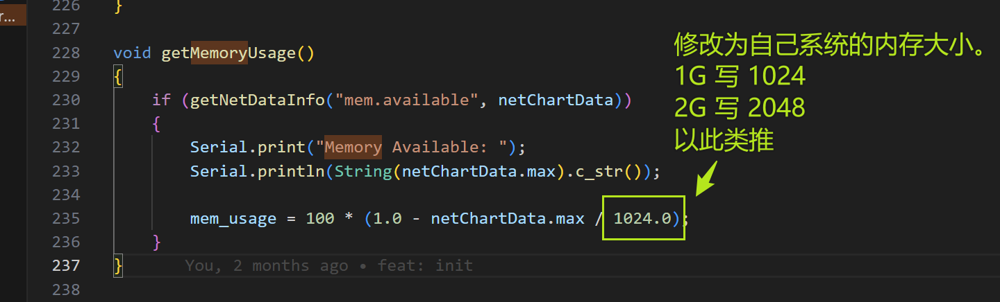

## 编译并烧录
1. USB连接上小电视或者开发板
2. VSCode点击左侧platformIO的图表，点击`Upload and Monitor` 等待编译烧录完成即可
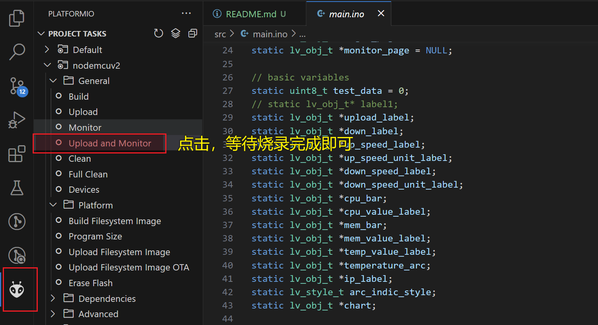

# FAQ
## 1. 烧录后温度信息不显示
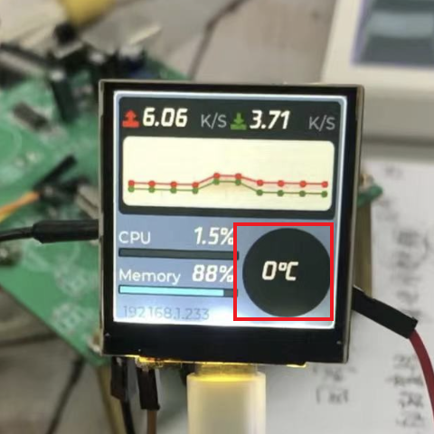

参考资料：
https://hiwbb.com/2021/10/openwrt-netdata-show-temperature/

原因： 
1. netdata.conf 中关闭了插件chart的显示
2. 基础软件 coreutils-timeout未安装

解决办法：

**登录openwrt终端**
1. 安装timeout：`opkg install coreutils-timeout`
2. 进入`/etc/netdata`
3. 使用`./edit-config charts.d.conf`来编辑配置文件，这个edit-config等于是一个配置工具能够从/usr/lib拉取默认配置过来，在配置里最后加入`sensors=force`。不加一定不会有温度，原因未知。
4. 用`/usr/lib/netdata/plugins.d/charts.d.plugin sensors`测一下，如果有一直跳数据出来，就说明成功了。
5. Openwrt的版本默认可能关闭了chart.d插件，编辑`/etc/netdata/netdata.conf`把`charts.d = no`改为`charts.d = yes`或直接注释掉那一行，若没有这行则不需要
6. 重启netdata： `/etc/init.d/netdata restart`

## 2. Netdata温度显示正常，但是monitor依旧不显示

如果netdata已经能够正常显示温度，大概率是因为 monitor 请求的key不对，不同的系统版本，温度sensor对应的key存在差异，修改方式如下. 从Netdata中找到温度曲线的key，替换到代码中getTemperature()方法请求温度的参数，两者需要保持一致
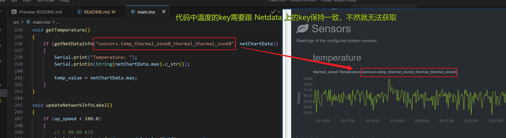
